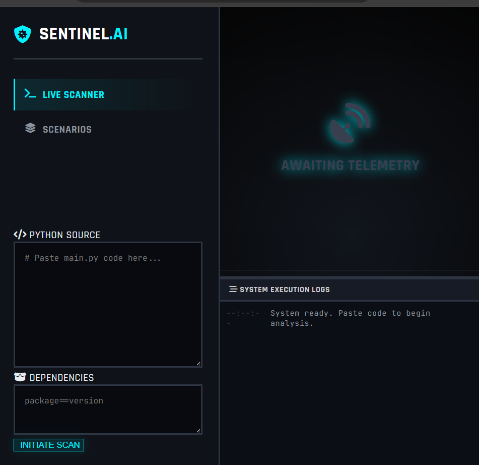
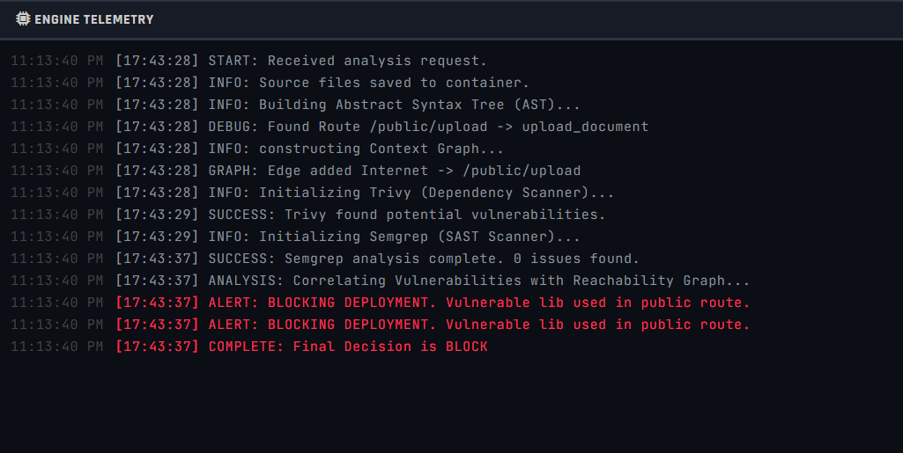
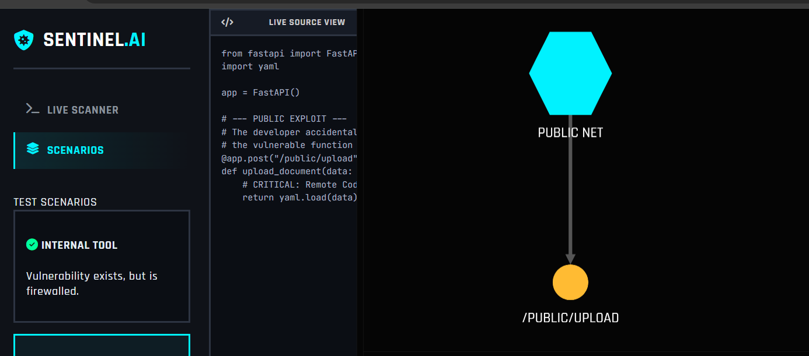

# 🛡️ Sentinel Gatekeeper
> **Context-Aware DevSecOps Policy Engine**



## 🚀 The Problem
Traditional security scanners (SAST/SCA) suffer from **Alert Fatigue**. They flag every vulnerability found, regardless of whether it is actually exploitable.
* **Example:** A critical vulnerability in a library that is only used by an internal admin tool, hidden behind a firewall.
* **Result:** Developers ignore security alerts because 90% are false positives.

## 💡 The Solution
**Sentinel** is a graph-based policy engine that introduces **Reachability Analysis** to the CI/CD pipeline.
1.  **Parses Source Code (AST):** Builds a call graph of the application.
2.  **Maps Infrastructure:** Identifies public API endpoints vs. private internal routes.
3.  **Correlates Vulnerabilities:** Only blocks deployment if a vulnerability is reachable from the public internet.

## 🛠️ Tech Stack
* **Engine:** Python 3.12 (AST, NetworkX)
* **Scanners:** Trivy (Dependencies), Semgrep (SAST)
* **Visualization:** Cytoscape.js
* **Containerization:** Docker (Debian Slim)
* **Architecture:** REST API (FastAPI)

## ⚡ How to Run

### Option 1: Docker (Recommended)
This is the easiest way to run the full environment with all scanners pre-installed.
```bash
docker build -t sentinel-gatekeeper .
docker run -p 8000:8000 sentinel-gatekeeper
```

### Option 2: Local Development
If you want to edit the python code and see changes instantly.

```Bash
# 1. Install dependencies
pip install -r requirements.txt

# 2. Run the backend
uvicorn app.main:app --reload --host 0.0.0.0 --port 8000
```
### 📸 Screenshots


## 🛡️ Sentinel Dashboard (Scenario Mode)
*Interactive dashboard allowing users to toggle between "Safe" and "Risky" architectural patterns.*


## ⛔ Security Block Enforced
*The engine detects a critical vulnerability on a public route and automatically blocks the deployment pipeline.*


## 🕸️ Reachability Graph
*Visualizing the attack path from the Public Internet to the internal vulnerable component.*

